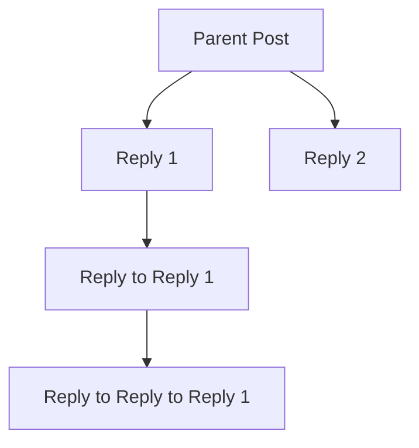

# Modern Threaded Forum Interface Plan

## 1. Threaded Hierarchy & Indentation
- Use the `depth` prop in `ForumPostCard` to apply a left margin or padding for each reply.
  - **Desktop:** 16px per depth level (configurable between 10–20px).
  - **Mobile:** 8px per depth level (configurable between 5–10px).
- Indentation visually indicates reply hierarchy.

## 2. Connector Lines
- Add a vertical connector line to the left of each reply, connecting it to its parent.
  - Use a 1px, light gray line (`#e0e0e0` or similar).
  - Use CSS pseudo-elements or an absolutely positioned SVG for curves/angles.
  - On mobile, simplify connectors (straight lines, less visual clutter).

## 3. Collapsible Threads
- Add a collapse/expand button to parent posts with replies.
  - Clicking toggles visibility of all child replies.
  - Use a chevron icon that rotates on collapse/expand.

## 4. Hover Effects
- On hover, highlight the thread (parent and all descendants) with a subtle background or border.
- Use a light background shade or border color for clarity.

## 5. Spacing & Aesthetics
- Use 8–12px vertical spacing between posts/replies.
- Keep card backgrounds, borders, and shadows minimal for a clean look.

## 6. Avatars & Usernames
- Display avatar and username for each post/reply.
- Keep avatar size small (32–40px) for replies.

## 7. Responsiveness
- On mobile:
  - Reduce indentation and connector complexity.
  - Stack elements vertically for readability.
  - Ensure touch targets are large enough.

## 8. Accessibility
- Ensure keyboard navigation for collapsing/expanding threads.
- Use ARIA attributes for collapsible sections.

---

## Mermaid Diagram: Threaded Forum Structure

- Each arrow represents a connector line.
- Each node is indented according to its depth.

---

## Implementation Steps

1. **Update ForumPostCard.tsx**
   - Apply indentation using the `depth` prop.
   - Add connector lines using CSS or SVG.
   - Add collapse/expand logic for replies.
   - Add hover effect to highlight thread.

2. **Update CSS**
   - Define styles for indentation, connectors, hover, and responsive behavior.

3. **Update renderPosts Logic**
   - Pass collapse/expand state and handlers as needed.

4. **Test Responsiveness**
   - Adjust indentation and connectors for mobile.

5. **Accessibility**
   - Add ARIA attributes and keyboard support.